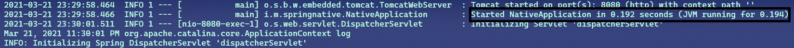

# Create a Spring Native Application

## Requirements

To compile and run this demo you will need:
- JDK 11
- Maven
- Docker

## Setup 

###### Start spring application
```bash
mvn package spring-boot:run
```

###### Build the native application
```bash
mvn spring-boot:build-image
```

###### Run the native application
```bash
docker run -p 8080:8080 spring-native-example:1.0.0
```


